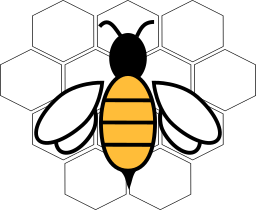

<h1 align="center">
   
  
   
  Nectar Framework
   
</h1>

<h4 align="center">A framework for execution and monitoring of smart contracts</h4>

    

 

## Table of contents
  - 

    
<a href="#architectural-design">Architectural Design</a>

    - [Inbound Events Queue](#inbound-events-queue)
    - [Event Handler](#event-handler)
    - [Smart Contract Execution Queue](#smart-contract-execution-queue)
    - [Contract Invoker](#contract-invoker)
    - [Smart Contract Outbound Queue](#smart-contract-outbound-queue)
    - [Event Updater](#event-updater)
  
  
 

## Architectural Design

### Inbound Events Queue
### Event Handler
### Smart Contract Execution Queue
### Contract Invoker
### Smart Contract Outbound Queue
### Event Updater

## License
Copyright © 2024 [The Applied Computing Research Group (GCA)](https://github.com/gca-research-group). 
This project is [MIT](https://github.com/gca-research-group/jabuti-dsl-language-model-transformation/blob/master/LICENSE) licensed.